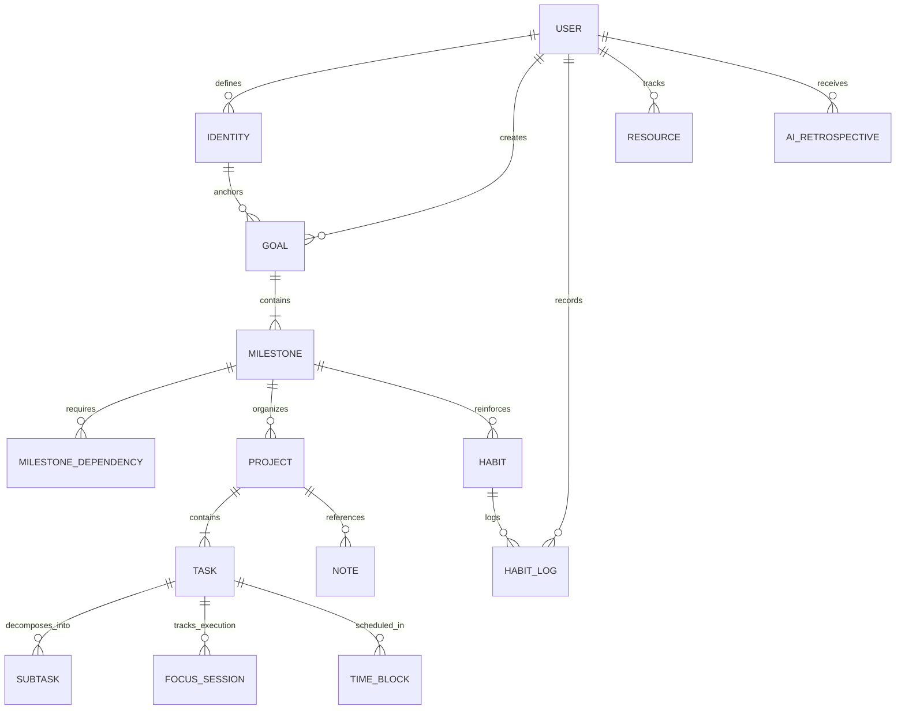

# Arete OS — Information Architecture and Domain Taxonomy

---

## 1. Domain Ontology and Mental Model

The core architecture of Arete organizes human experience into three distinct ontological layers:
1. **Strategic Intent Layer**: Who the user intends to become (Identities, Strategic Goals).
2. **Structural Bridge Layer**: How that intention is engineered into reality (Milestones, Projects, Knowledge Base).
3. **Tactical Execution Layer**: What the user does in the physical hour (Tasks, Habits, Focus Sessions, Time Blocks).

---

## 2. Entity Relationship Diagram (ERD)



---

## 3. Entity Definitions and Field Taxonomy

### 1. Identity
- `id`: UUID (Primary Key)
- `user_id`: UUID (Foreign Key -> Users)
- `title`: String (e.g. "Senior AI Kernel Architect")
- `vision_statement`: Text
- `color_token`: String (e.g. `cosmic_violet`)
- `created_at`: Timestamp with timezone

### 2. Goal
- `id`: UUID (Primary Key)
- `identity_id`: UUID (Foreign Key -> Identity)
- `title`: String
- `objective_statement`: Text
- `target_deadline`: Date
- `priority`: Enum (`P0_CRITICAL`, `P1_STRATEGIC`, `P2_SUPPORTING`)
- `status`: Enum (`DRAFT`, `ACTIVE`, `ACHIEVED`, `PAUSED`, `ABANDONED`)
- `weighted_progress`: Float (0.0 to 100.0)

### 3. Milestone
- `id`: UUID (Primary Key)
- `goal_id`: UUID (Foreign Key -> Goal)
- `title`: String
- `weight_multiplier`: Float (e.g. 1.0 to 5.0)
- `deadline`: Date
- `status`: Enum (`PENDING`, `ACTIVE`, `BLOCKED`, `COMPLETED`)
- `dependency_milestone_ids`: Array of UUIDs

### 4. Project
- `id`: UUID (Primary Key)
- `milestone_id`: UUID (Foreign Key -> Milestone)
- `title`: String
- `description_markdown`: Text
- `status`: Enum (`BACKLOG`, `IN_PROGRESS`, `REVIEW`, `COMPLETED`)
- `timeline_start`: Date
- `timeline_end`: Date

### 5. Task
- `id`: UUID (Primary Key)
- `project_id`: UUID (Foreign Key -> Project)
- `title`: String
- `priority`: Enum (`P0`, `P1`, `P2`)
- `cognitive_tier`: Enum (`DEEP_3X`, `MEDIUM_2X`, `SHALLOW_1X`)
- `estimated_minutes`: Integer
- `actual_minutes_logged`: Integer
- `is_completed`: Boolean
- `completed_at`: Timestamp with timezone
- `postpone_count`: Integer
- `recurrence_rrule`: String (Optional)

### 6. Habit
- `id`: UUID (Primary Key)
- `milestone_id`: UUID (Optional Foreign Key -> Milestone)
- `title`: String
- `target_frequency`: Enum (`DAILY_MORNING`, `DAILY_EVENING`, `WEEKLY_TARGET`, `MONTHLY`)
- `target_count_per_period`: Integer
- `current_consistency_score`: Float (0.0 to 100.0)

### 7. Focus Session
- `id`: UUID (Primary Key)
- `task_id`: UUID (Foreign Key -> Task)
- `duration_seconds`: Integer
- `acoustic_preset`: Enum (`BINAURAL_40HZ`, `BROWN_NOISE`, `OBSIDIAN_RAIN`, `TERMINAL_HUM`, `SILENT`)
- `focus_quality_score`: Float (0.0 to 10.0)
- `started_at`: Timestamp with timezone
- `ended_at`: Timestamp with timezone

### 8. Knowledge Note
- `id`: UUID (Primary Key)
- `project_id`: UUID (Optional Foreign Key -> Project)
- `title`: String
- `content_markdown`: Text
- `vector_embedding`: Vector(1536) (pgvector index)
- `bidirectional_links`: Array of UUIDs

---

## 4. Web Application URL and Routing Hierarchy

```
/
├── /auth (Login, Registration, Password Reset)
├── /onboarding (Initial Identity & Goal Blueprint Setup)
└── /app (Stateful Shell Route with Command Deck & Sidebar)
    ├── /dashboard (Mission Control HUD)
    ├── /goals (Goal Graph & Milestone DAG)
    │   └── /:goalId (Single Goal Detail, Milestones, Projects)
    ├── /projects (Kanban & Timeline Matrix)
    │   └── /:projectId (Project Canvas & Architecture Notes)
    ├── /tasks (Unified Task Matrix & Filter Engine)
    ├── /habits (Habit Integrity & 365-day Consistency Heatmaps)
    ├── /calendar (Time-Blocking Agenda & Week Grid)
    ├── /focus (Fullscreen Deep Work Environment)
    ├── /analytics (Velocity Curves, Energy Heatmaps & Friction Radar)
    ├── /knowledge (Semantic Notes & Wiki Graph)
    │   └── /:noteId (Rich Markdown Editor)
    ├── /resources (Books, Courses, Papers Library)
    ├── /coach (AI Retrospectives & Dynamic Schedules)
    ├── /friends (Accountability War-Rooms & Group Challenges)
    └── /settings (Appearance, Keyboard Shortcuts, Encryption, Backups)
```
