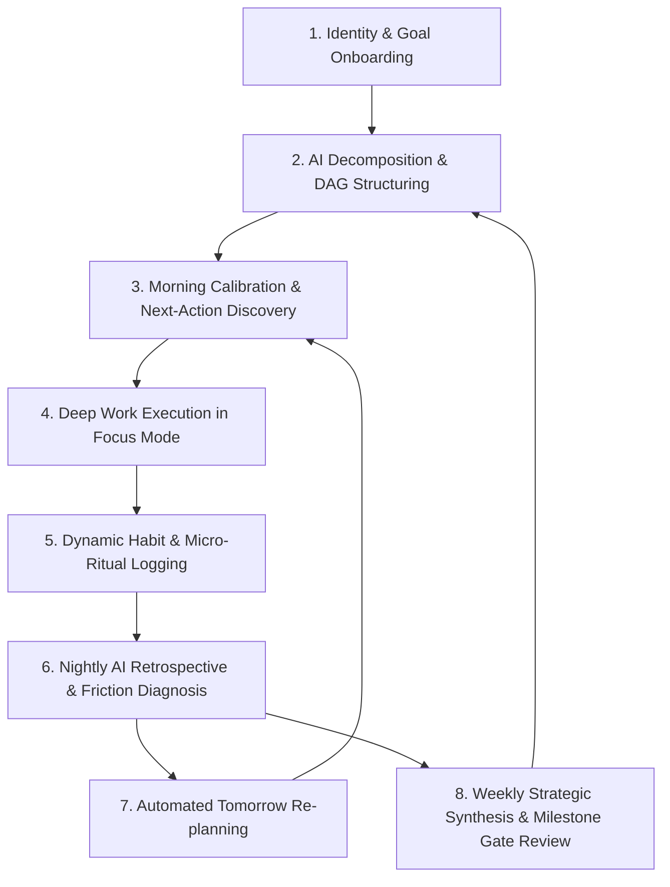

# Arete OS — End-to-End User Journeys and Flow Architecture

---

## 1. Master System Flow Diagram

---

## 2. Granular Step-by-Step Flow Specifications

### Phase 1: Identity and Goal Onboarding Flow
1. **Entry Point**: Web app loads at `/onboarding`.
2. **Step 1 — Identity Declaration**: The user inputs their aspirational identity (e.g. "Senior AI Kernel Engineer" or "Bootstrapped SaaS Founder").
3. **Step 2 — Strategic Goal Framing**: The user defines 1 to 3 quantitative, high-stakes goals with target deadlines.
4. **Step 3 — Automated AI Decomposition**:
   - The system calls the Supabase Edge Function to analyze the goal.
   - The AI generates a structured proposal: 3 to 5 chronological Milestones, associated Projects, critical Habits, and first-week Tasks.
5. **Step 4 — DAG Review and Calibration**: The user adjusts weights, rearranges dependencies via drag-and-drop, and approves the blueprint.
6. **Step 5 — Transition**: The user is routed directly to the Mission Control Dashboard at `/app/dashboard`.

---

### Phase 2: Morning Calibration and Planning Flow
1. **Time Window**: 06:00 to 09:00 daily.
2. **Action**: The user opens the web app or presses `Cmd+K -> Morning Calibration`.
3. **Energy Input**: Single-click rating of physical/cognitive readiness (1 to 5 scale).
4. **Schedule Review**: The system presents the pre-computed day schedule generated by the previous night's AI review.
5. **Next Action Lock**: The Mission Control HUD highlights the single highest-leverage task for the morning deep work session.

---

### Phase 3: High-Performance Deep Work Execution Flow
1. **Trigger**: User presses `Cmd+Enter` on the Next-Action card or triggers `Cmd+K -> Focus`.
2. **Immersion Transition**:
   - The UI undergoes a smooth 350ms cross-fade into full-screen Focus Mode.
   - Sidebars, navigation tabs, and notification badges are hidden.
   - Selected ambient soundscape (e.g. 40Hz Binaural or Brown Noise) initializes seamlessly.
3. **Execution**:
   - Monospaced timer counts down.
   - Subtasks can be checked off using keyboard shortcuts (`Cmd+D`).
   - Quick thoughts or code snippets can be logged into the contextual scratchpad without leaving the screen (`Cmd+N`).
4. **Completion**:
   - When the timer concludes, a soft chime sounds.
   - Focus telemetry is recorded (duration, focus score, tasks completed).
   - The user is transitioned to a 5-minute structured recovery screen before returning to the dashboard.

---

### Phase 4: Habit and Micro-Ritual Logging Flow
1. **Friction-Free Interaction**: Habits are visible as a streamlined horizontal bar on the HUD or sidebar.
2. **One-Key Verification**: Pressing the designated habit shortcut or clicking the habit circle logs completion instantly.
3. **Vector Update**: The 30-day consistency vector recalculates immediately with zero page reload.

---

### Phase 5: Nightly AI Retrospective and Re-Planning Flow
1. **Trigger**: 21:30 notification prompt or user command `Cmd+K -> Evening Review`.
2. **Review Dialog**:
   - System presents summary of logged deep work hours, completed tasks, and habits.
   - If tasks were postponed, the user selects a quick friction reason (Scope too big, Energy drop, External blocker).
3. **AI Cognitive Synthesis**:
   - The AI Coach generates a 3-sentence retrospective.
   - Suggests dynamic adjustments for tomorrow's time blocks (e.g. moving high-demand tasks earlier if evening energy was low).
4. **Approval**: User presses `Cmd+Enter` to lock tomorrow's schedule.

---

### Phase 6: Weekly Strategic Milestone Review Flow
1. **Cadence**: Every Sunday evening.
2. **Roadmap Audit**: The user reviews the Goal & Milestone DAG.
3. **Velocity Assessment**: System compares actual milestone velocity against the target burn-up cone.
4. **Milestone Gate Sign-off**: When all underlying projects reach 100%, the milestone transitions to Completed, dynamically increasing parent Goal completion percentage.

---

## 3. Edge Case Handling and Resilience Flows

### Scenario A: Multi-Day Disruption / Illness
- **Problem**: In conventional apps, missing 4 days breaks a 90-day streak, causing demotivation.
- **Arete Flow**: The user logs a "Recovery / Illness" status. The Habit Engine adjusts the recency weight rather than resetting the score to zero. The AI Coach automatically reschedules missed tasks across future open time-blocks without creating an overwhelming single-day backlog.

### Scenario B: Offline Web Execution
- **Problem**: User works on an airplane or train without internet access.
- **Arete Flow**: All edits, task completions, and focus sessions write directly to local IndexedDB/Hive. Mutations are appended to an in-memory sync queue. Upon network reconnection, the synchronization engine pushes changes to Supabase using conflict-free merge logic.
